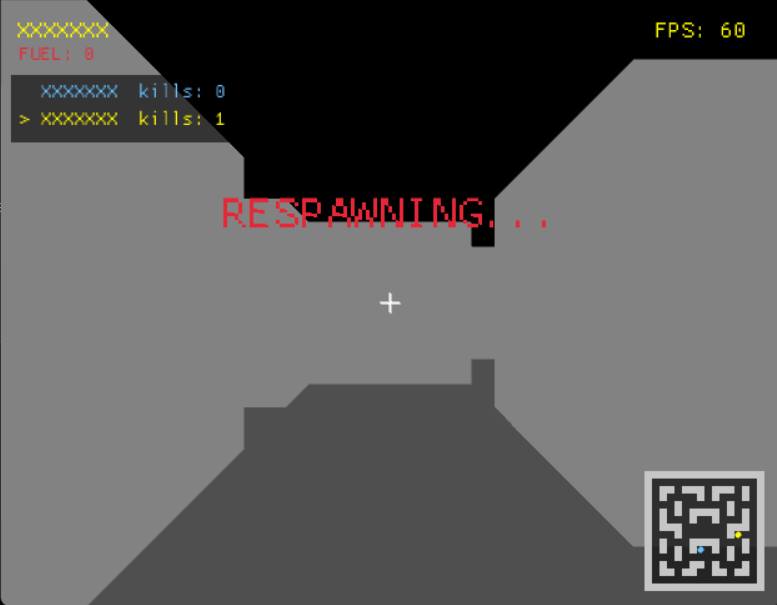

<h1 align="center">🌀 Maze Runner FPS</h1>

A multiplayer first person maze shooter built in Rust, in the spirit of the classic Maze Wars, played over a client-server architecture using UDP.

<p align="center">
  
</p>

<p align="center">
  
  
</p>

## 📋 Table of Contents

- [📦 Requirements](#-requirements)
- [🚀 Quick Start](#-quick-start)
- [⚙️ Detailed Setup](#️-detailed-setup)
- [🌐 Connecting from Another Machine](#-connecting-from-another-machine)
- [👥 Multiple Clients](#-multiple-clients)
- [🎮 Controls](#-controls)
- [🕹️ How the Game Works](#️-how-the-game-works)
- [⚠️ Known Limitations](#️-known-limitations)
- [🗂️ Project Structure](#️-project-structure)
- [🎓 Audit Compliance](#-audit-compliance)
- [⭐ Bonus Features](#-bonus-features)
- [👤 Author](#-author)
- [📄 License](#-license)

---

## 📦 Requirements

**To run the server**, either of the following works:

- Docker only, no other installation needed, everything the server needs is packaged inside the container, **or**
- Rust, installed via [rustup](https://rustup.rs), if you'd rather run it directly with Cargo

**To run the client:** Rust, installed via [rustup](https://rustup.rs), the same install method works on Windows, macOS, and Linux. The client always requires Rust, there is no Docker option for it, see [Known Limitations](#️-known-limitations) for why.

---

## 🚀 Quick Start

The server can be run either way, whichever is more convenient. Both connect and play identically.

### Option 1: Server via Docker (no Rust required)

```bash
docker compose up server -d
```

### Option 2: Server via Cargo (requires Rust)

```bash
cargo run -p server --release
```

Either way, in a separate terminal, run the client natively. The client always requires Rust, regardless of how the server was started.

```bash
cargo run -p client --release
```

When prompted, enter the server's address and a username of your choice.

```
Enter IP Address: 127.0.0.1:34254
Enter Name: yourname
```

---

## ⚙️ Detailed Setup

### Running the server on a specific level or port

The server defaults to level 1 on port 34254. To choose a different level or port, override the container's command directly and include `--service-ports` so the port mapping still applies.

```bash
docker compose run --rm --service-ports server --level 2
docker compose run --rm --service-ports server --level 3 --port 40000
```

If running the server via Cargo instead of Docker, pass the same flags directly.

```bash
cargo run -p server --release -- --level 2
cargo run -p server --release -- --level 3 --port 40000
```

---

## 🌐 Connecting from Another Machine

The server binds to `0.0.0.0`, meaning it accepts connections from any address, not just `localhost`. To connect from a different machine on the same network, find the host machine's local IP address and use that instead of `127.0.0.1` when the client asks for the server address.

```
Enter IP Address: 192.168.1.10:34254
```

---

## 👥 Multiple Clients

Any number of clients can connect to the same server, each is simply run the same way, in its own terminal.

```bash
cargo run -p client --release
```

---

## 🎮 Controls

<div align="center">

|       Key       |                       Action                        |
| :-------------: | :-------------------------------------------------: |
| `W` `A` `S` `D` |           Move forward, left, back, right           |
|      Mouse      |                     Look around                     |
|     `←` `→`     | Turn left / right (fallback, see Known Limitations) |
|   Left click    |                  Capture the mouse                  |
|   Right click   |                        Shoot                        |
|    `Escape`     |                  Release the mouse                  |
|       `Q`       |                    Quit cleanly                     |

</div>

---

## 🕹️ How the Game Works

Players spawn at a random open point in the maze and explore in first person. Shooting another player scores a kill, and the first player to reach 10 kills wins the match, after which everyone's score resets and a new round begins.

Fuel drains steadily over time. Running out of fuel, or being shot, sends a player back to a fresh spawn point after a short respawn delay, during which they cannot be seen or shot.

Three levels are available, each a fixed 16x16 maze of increasing difficulty, more dead ends and longer paths on the higher levels.

---

## ⚠️ Known Limitations

Mouse look is confirmed working smoothly on native Windows and native Linux.

Under WSL specifically (Windows Subsystem for Linux), the underlying display system, WSLg, does not reliably deliver raw mouse motion to the game, this is a limitation of that specific environment rather than the game itself. The arrow keys are provided as a reliable fallback for turning in that case.

---

## 🗂️ Project Structure

```
Maze-Runner-FPS/
├── shared/     Types and data shared by both server and client (map, network packets)
├── server/     The authoritative game server (Tokio, async)
├── client/     The graphical client (macroquad)
└── docker/     Server Dockerfile
```

---

## 🎓 Audit Compliance

As part of the 01 Founders curriculum, this project is verified through a peer audit checking functionality against the brief's requirements.

### Functional

**Server**

- ✅ Compiles and runs without any warnings

**Client (same machine as server)**

- ✅ Compiles and runs without any warnings
- ✅ Asks for the server's IP address on startup
- ✅ Successfully connects to the server once given a correct address
- ✅ Asks for a username
- ✅ Opens the graphical interface
- ✅ Displays a minimap of the maze
- ✅ Shows your own position on the minimap
- ✅ Minimap position updates as you move
- ✅ Camera view updates as you move
- ✅ Frame rate is displayed on screen
- ✅ Frame rate stays consistently above 50 fps

**Connecting from another machine**

- ✅ The server accepts connections from any IP address, not only `localhost`
- ✅ Verified working across two genuinely separate machines (Windows and WSL) on the same network
- ✅ Verified working with multiple simultaneous clients connecting via `localhost`

**Multiple simultaneous players, 3+ minutes**

- ✅ Frame rate remained above 50 fps throughout
- ✅ Gameplay felt smooth regardless of the displayed frame rate

### Bonus

- ⭐ Custom maze editing (not implemented)
- ⭐ Procedurally generated levels (not implemented, three fixed hand designed levels are provided instead)
- ⭐ AI players (not implemented)
- ⭐ Host history with saved aliases for quicker reconnection (not implemented)

---

## ⭐ Bonus Features

Beyond the core brief, this project also includes:

- A live scoreboard showing every connected player's username and kill count
- A cosmetic flying projectile shown for every shot fired, whether it hits or misses
- A dedicated quit key that notifies the server instantly on a clean exit, rather than waiting on a timeout
- Full documentation across the shared crate explaining every type and its purpose
- A Dockerized server, requiring no Rust installation at all to host a match

---

## 👤 Author

**Ibraheem Youssef** ([@IbsYoussef](https://github.com/IbsYoussef))

---

## 📄 License

This project is licensed under the MIT License.

```
MIT License

Copyright (c) 2026 Ibraheem Youssef

Permission is hereby granted, free of charge, to any person obtaining a copy
of this software and associated documentation files (the "Software"), to deal
in the Software without restriction, including without limitation the rights
to use, copy, modify, merge, publish, distribute, sublicense, and/or sell
copies of the Software, and to permit persons to whom the Software is
furnished to do so, subject to the following conditions:

The above copyright notice and this permission notice shall be included in all
copies or substantial portions of the Software.

THE SOFTWARE IS PROVIDED "AS IS", WITHOUT WARRANTY OF ANY KIND, EXPRESS OR
IMPLIED, INCLUDING BUT NOT LIMITED TO THE WARRANTIES OF MERCHANTABILITY,
FITNESS FOR A PARTICULAR PURPOSE AND NONINFRINGEMENT. IN NO EVENT SHALL THE
AUTHORS OR COPYRIGHT HOLDERS BE LIABLE FOR ANY CLAIM, DAMAGES OR OTHER
LIABILITY, WHETHER IN AN ACTION OF CONTRACT, TORT OR OTHERWISE, ARISING FROM,
OUT OF OR IN CONNECTION WITH THE SOFTWARE OR THE USE OR OTHER DEALINGS IN THE
SOFTWARE.
```

---

<p align="center">
  <a href="#maze-runner-fps">⬆ Back to top</a>
</p>

<p align="center">
  🦀 Built with Rust + 🎮 macroquad + ⚡ Tokio
</p>
